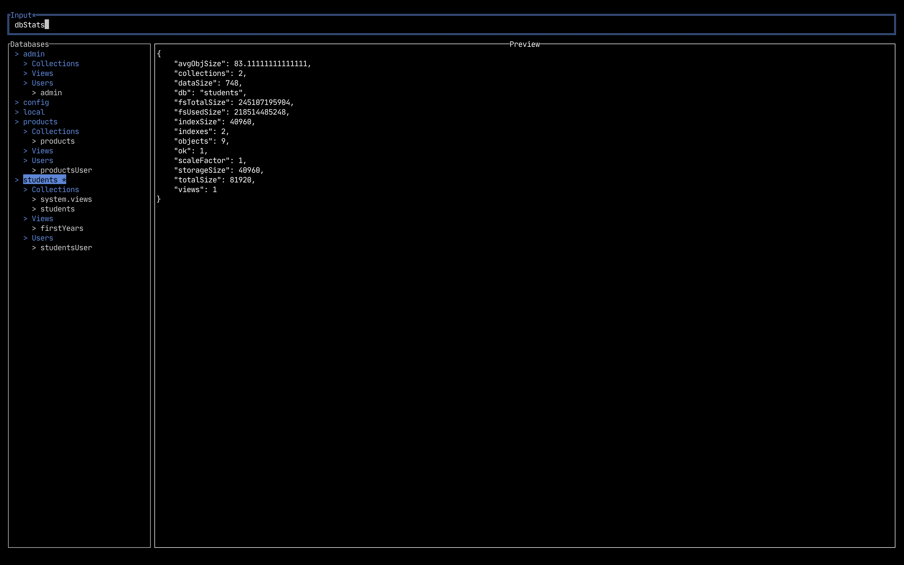

# bongo
This is a prototype of a program to navigate through mongo resources (databases, collections, etc.)
and run commands to it. Basically, it's almost a k9s version for mongo databases.

# Screenshot

# Features to do
- Make a database tree (expand each collection to a tree to view collections, views, users, etc.)
and navigate through them.
- Make a preview when viewing those items above
- Make an input field to run commands against the mongo connection, i.g. `db.getUsers()`

## Contributing
See [CONTRIBUTING.md](./CONTRIBUTING.md).

## License
[MIT](./LICENSE)
